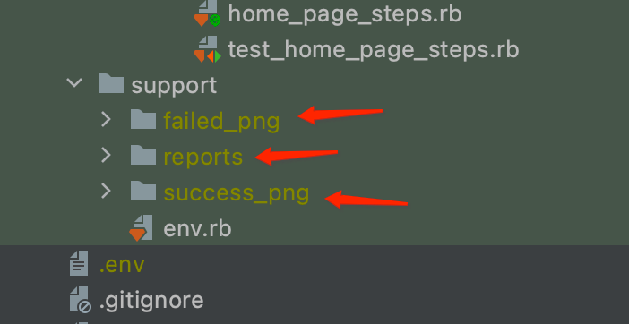

# machtwatch_web_automation
Software Automation Testing for Machtwatch using ruby and cucumber

## How to Setup (Mac)

1. Install [Iterm](https://iterm2.com/downloads.html)


2. Install [Xcode](https://apps.apple.com/us/app/xcode/id497799835?mt=12)


3. Install [Homebrew](https://brew.sh/)

  ```
  /bin/bash -c "$(curl -fsSL https://raw.githubusercontent.com/Homebrew/install/HEAD/install.sh)"
  ```

4. Install [RVM](https://rvm.io/)

  ```
  curl -L get.rvm.io | bash -s stable
  source ~/.bash_profile
  ```

5. Install Ruby 2.6.3

  ```
  rvm install 2.6.3
  ```

6. Install CMake

  ```
    brew install cmake pkg-config && sudo ln -s /usr/local/bin/make /usr/local/bin/gmake
  ```

7. Install Git

  ```
    brew install git
  ```

8. Configure Git

  ```
    git config --global user.name "Your Name Here"
    git config --global user.email "your-github-email@example.com"
  ```

9. Generate Public Key

  ```
    ssh-keygen # then, just press enter
  ```

10. Add key to Github

  ```
    pbcopy < ~/.ssh/id_rsa.pub # then, paste and add key to Github
  ```

11. Clone the project

  ```
    git clone git@github.com:machtwatch/machtwatch_web_automation.git
  ```

12. Go to you IDE and open the machtwatch_web_automation project then Copy .env File

  ```
    cp env.sample .env
  ```

13. Create this folder in the machtwatch_web_automation



14. Setup Gem

  ```
    rvm use 2.7.8
    gem install bundler
    bundle install
  ```

15. Run the Test

  ```
    cucumber TARGET=dev BROWSER=firefox PRIVATE=no HEADLESS=no --tags @login
    OR
    cucumber TARGET=dev BROWSER=firefox PRIVATE=no HEADLESS=no -t @login -t @desktop --retry 3 --no-strict-flaky -f rerun --out rerun.txt
    OR
    # -t: your spesific tags, -n: concurrent_browser do you want
    bundle exec parallel_cucumber features/ -n 1 -o '-t @your_tag,@your_tag,~@not_include_tag'
  ```
